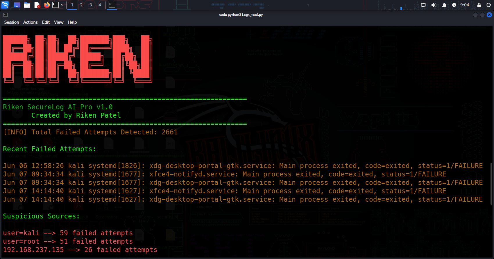
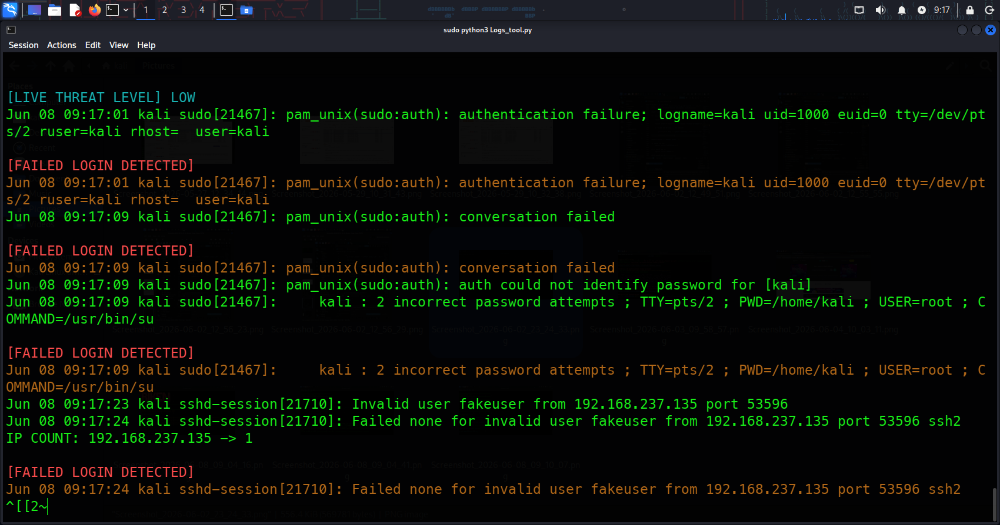
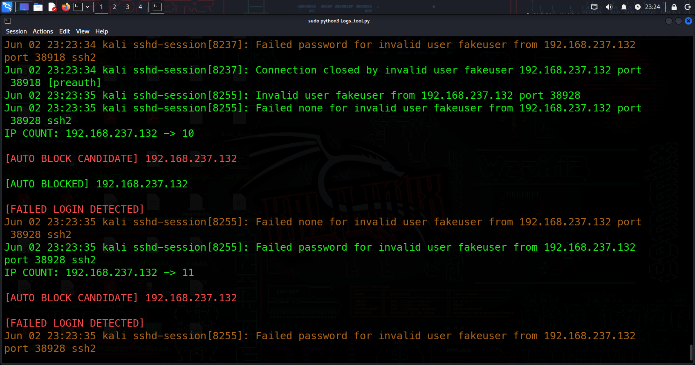
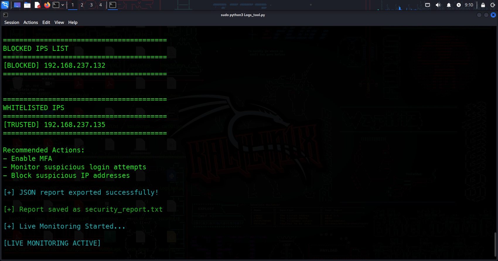
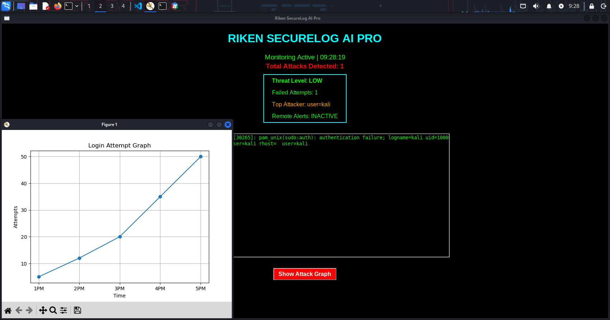

RikenSecureLogAI

A Python-based SOC-style security monitoring tool for Linux systems that performs real-time log analysis, detects suspicious authentication activity, tracks brute-force attempts, and automatically responds to threats.

Features

* Real-Time Log Monitoring using journalctl
* Failed Login Detection
* Successful Login Detection
* SSH Brute Force Detection
* Suspicious Source Identification
* Per-IP Failed Attempt Tracking
* Dynamic Threat Level Assessment
* Automatic IP Blocking using iptables
* Whitelist IP Support
* Blocked IP Tracking
* TXT Report Generation
* JSON Report Generation
* SOC-Style Terminal Dashboard

Technologies Used

* Python 3
* Linux
* journalctl
* iptables
* Colorama

Installation

Clone the repository:

git clone https://github.com/riken-cybersec/RikenSecureLogAI.git

cd RikenSecureLogAI

Install dependencies:

pip install -r requirements.txt

Run the tool:

sudo python3 Logs_tool.py

Use Cases

* Linux Security Monitoring
* SSH Brute Force Detection
* Security Operations Center (SOC) Learning
* Blue Team Practice
* Cybersecurity Lab Environments

Project Structure

Logs_tool.py
dashboard.py
requirements.txt
README.md
.gitignore

Future Improvements

* GUI Dashboard
* CSV Report Export
* Attack Timeline Visualization
* Telegram Notifications
* Advanced Threat Analytics

## Screenshots

### Tool Startup

### Failed Login Detection

### Auto IP Blocking

### Whitelist IP Feature

### Dashboard Overview

Author

Riken Patel

Cybersecurity Enthusiast | RHCSA Certified | SOC Analyst Aspirant | Ethical Hacker
